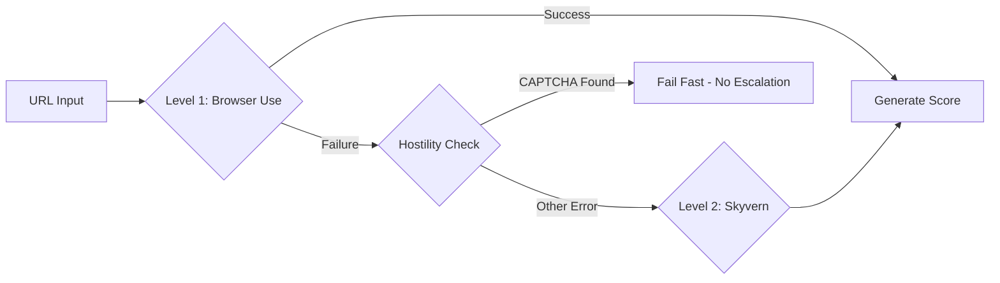

# AgentRank.it

> **The PageSpeed Insights for the Agentic Web**

[](LICENSE)
[](https://nodejs.org/)
[](https://www.typescriptlang.org/)

AgentRank.it measures how reliably an AI agent can navigate your website. While Google PageSpeed Insights measures how fast a site loads for humans, we measure the **Agent Visibility Score** — a 0-100 rating of how well AI agents can understand and interact with your site.

## 🚀 Quick Start

```bash
# Install dependencies
npm install

# Run an audit
npx tsx src/cli/index.ts audit https://example.com

# Build for production
npm run build

# Run built CLI
npm start audit https://example.com
```

## 📊 Agent Visibility Score

The score is composed of 5 weighted signals:

| Signal | Weight | What It Measures |
|--------|--------|------------------|
| **Permissions** | 20% | `robots.txt` / `ai.txt` analysis |
| **Structure** | 25% | Semantic HTML density (div soup detection) |
| **Accessibility** | 25% | Accessibility tree depth & ARIA labeling |
| **Hydration** | 15% | Time-to-Interactive for JS rendering |
| **Hostility** | 15% | Bot-blockers (CAPTCHA, Cloudflare, etc.) |

## 🏗️ Architecture: Two-Speed Design

AgentRank uses a **Reactive Escalation** architecture to balance cost and accuracy:

### Level 1: Speed Reader (Default)
- **Engine**: Playwright via Browser Use
- **Input**: Structured Accessibility Tree (text-only tokens)
- **Cost**: ~$0.002/scan
- **Speed**: <5 seconds

### Level 2: Visual Resolver (Fallback)
- **Trigger**: `InteractionFailed`, `NodeNotClickable`, or `ElementIntercepted`
- **Engine**: Skyvern (Vision-LLM)
- **Cost**: ~$0.02/scan
- **Speed**: 30-90 seconds



## 💻 CLI Usage

```bash
# Quick scan (default)
agentrank audit https://example.com

# Deep scan with visual fallback
agentrank audit https://example.com --mode deep

# JSON output
agentrank audit https://example.com --json

# Start MCP server for IDE integration
agentrank mcp --port 3000
```

## 🔌 MCP Integration

AgentRank exposes an MCP server for IDE integration with Cursor and Claude Desktop:

```json
POST /mcp
{
  "action": "audit",
  "url": "https://example.com",
  "mode": "quick"
}
```

**Response:**

```json
{
  "status": "success",
  "meta": { "url": "https://example.com", "cost_usd": 0.002 },
  "agent_score": 78,
  "signals": {
    "permissions": { "status": "pass", "details": "robots.txt allows GPTBot" },
    "structure": { "status": "warn", "details": "Low semantic density" }
  },
  "narrative": {
    "transcript": "I navigated to the homepage. I found 'Sign Up' but it lacked an accessible label..."
  },
  "escalation": { "triggered": false }
}
```

## 📦 Programmatic Usage

```typescript
import { scanUrl } from 'agentrank';

const result = await scanUrl({
  url: 'https://example.com',
  mode: 'quick',
  timeout: 30000,
});

console.log(`Agent Score: ${result.agentScore}/100`);
console.log(`Transcript: ${result.narrative.transcript}`);
```

## 🛠️ Development

```bash
# Install dependencies
npm install

# Run in development mode
npm run dev -- audit https://example.com

# Type check
npm run typecheck

# Lint
npm run lint

# Format
npm run format

# Run tests
npm test
```

## 📁 Project Structure

```
src/
├── cli/              # CLI entry point (Commander.js)
├── core/
│   ├── scanner.ts    # Main scanner orchestrator
│   └── score.ts      # Score calculation
├── analyzers/        # Signal analyzers (5 modules)
│   ├── permissions.ts
│   ├── structure.ts
│   ├── accessibility.ts
│   ├── hydration.ts
│   └── hostility.ts
├── engines/
│   ├── browser-use.ts  # Level 1: Playwright
│   └── skyvern.ts      # Level 2: Vision fallback
├── mcp/              # MCP server for IDE integration
├── transcript/       # Think-Aloud narrative generator
└── types/            # TypeScript interfaces
```

## 📜 License

Copyright 2025 Kiarash Adl

Licensed under the Apache License, Version 2.0. See [LICENSE](LICENSE) for details.
